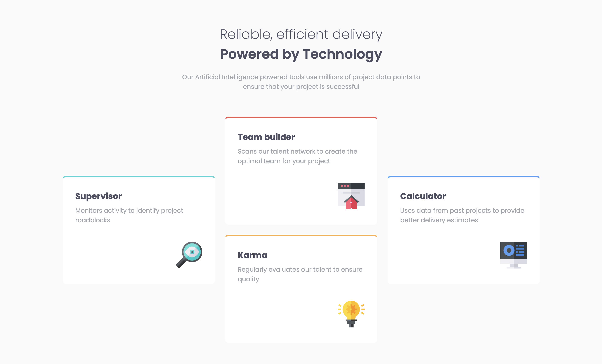

# Frontend Mentor - Four card feature section solution

This is a solution to the [Four card feature section challenge on Frontend Mentor](https://www.frontendmentor.io/challenges/four-card-feature-section-weK1eFYK). Frontend Mentor challenges help you improve your coding skills by building realistic projects.

## Table of contents

- [Overview](#overview)
  - [The challenge](#the-challenge)
  - [Screenshot](#screenshot)
  - [Links](#links)
- [My process](#my-process)
  - [Built with](#built-with)
  - [What I learned](#what-i-learned)
- [Author](#author)
- [Acknowledgments](#acknowledgments)

## Overview

### The challenge

Users should be able to:

- View the optimal layout for the site depending on their device's screen size

### Screenshot



### Links

- Solution URL: [Add solution URL here](https://your-solution-url.com)
- Live Site URL: [https://github.com/F9F6EE/Four-card-feature-section-on-Frontend-Mentor/settings/pages](https://github.com/F9F6EE/Four-card-feature-section-on-Frontend-Mentor/settings/pages)

## My process

### Built with

- Semantic HTML5 markup
- CSS custom properties
- Flexbox
- CSS Grid
- Mobile-first workflow

### What I learned

First time using 'align-self' & instead of using absolute position for the icon, aligning all the card content to the right and the text to the left helped to put the icons in the good position with some padding.

```css
.card-1,
.card-4 {
  align-self: center;
}

.card {
  background-color: white;
  border-radius: 7px;
  padding: 30px;
  text-align: right;
}

.card-text {
  text-align: left;
  margin-bottom: 2.5rem;
}
```

## Author

- Frontend Mentor - [@F9F6EE](https://www.frontendmentor.io/profile/F9F6EE)

## Acknowledgments

View the optimal layout for the site depending on their device's screen size, i've learn flexbox and grid more deeper, getting the good alignement was a bit tricky at some point but it was a good challenge.
